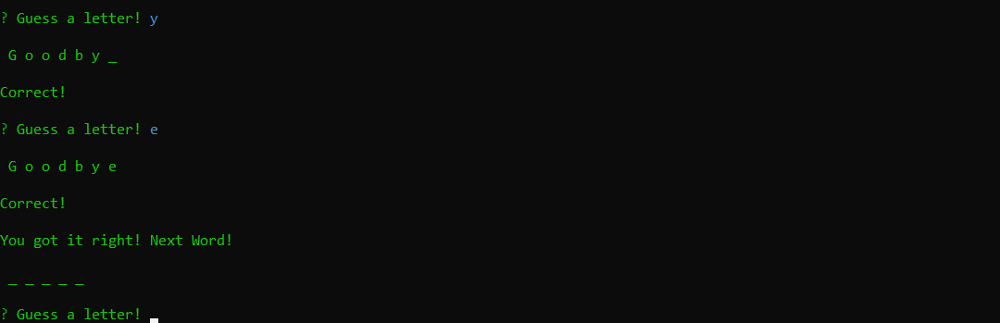

# bamazon

# Table of Contents
* [About](#about)
* [Technologies](#technologies)
* [Requirements](#requirements)
* [Instructions](#instructions)
* [The Game](#the-game)

# About
Word Guess is a command line hangman game. It picks a random word, then takes in user input and compares it to the word, to determine if the user guess was correct.

# Technologies
* Node.js
* Inquirer

# Requirements
* Node
* NPM

# Instructions
1. Clone the repository.
2. Run `npm i` (this will install the inquirer package).
3. Run the application by typing `node index.js`.
4. Consult the sections below for examples of the functionality of the application.

# The Game

In this application you attempt to guess the word by typing letters.

The following appears when you run the application.

Upon typing a letter that is in the word, you will see the following.

Upon typing a letter that is not in the word, you will see the following.

Upon succesful completion of a word, you will be congratulated and the game will advance to the next word, as shown below.

If you run out of guesses before completing the word, the game will display a different message before advancing to the next word.

